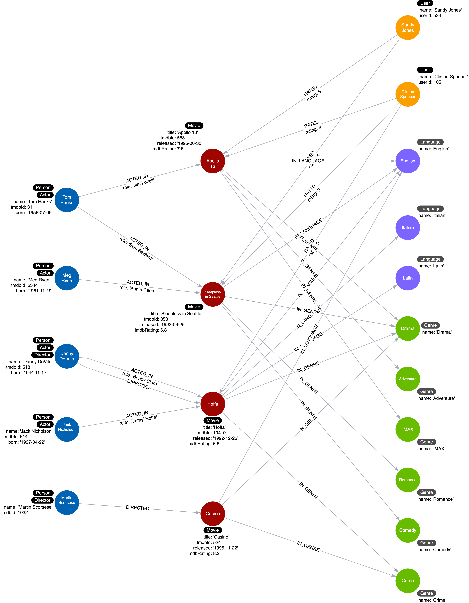
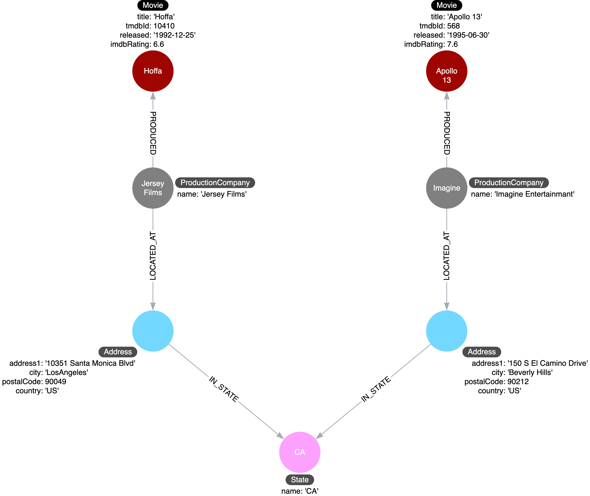

> [!IMPORTANT]
> A Neo4j graph has an optional schema which is quite flexible, unlike the schema in an RDBMS. A Cypher developer can easily modify the graph to represent an improved data model.

### Two types of model:
1. Data model - The data model describes the labels, relationships, and properties for the graph. It does not have specific data that will be created in the graph.
2. Instance model - An important part of the graph data modeling process is to test the model against the use cases. To do this, you need to have a set of sample data that you can use to see if the use cases can be answered with the model.

### Best practices during modelling
> A Neo4j best practice is to use the following when you name the elements of the graph, but you are free to use any convention for your application.

1. A label is a single identifier that begins with a capital letter and can be CamelCase. Examples: Person, Company, GitHubRepo
2. A relationship type is a single identifier that is in all capital letters with the underscore character. Examples: FOLLOWS, MARRIED_TO
3. A property key for a node or a relationship is a single identifier that begins with a lower-case letter and can be camelCase. Examples: deptId, firstName

### Node properties 
> Node properties are used to:
> - Uniquely identify a node.
> - Answer specific details of the use cases for the application.
> - Return data.

For example, in a Cypher statement, properties are used to:
Anchor (where to begin the query). 

```
MATCH (p:Person {name: 'Tom Hanks'})-[:ACTED_IN]-(m:Movie) RETURN m
```

Traverse the graph (navigation). 
```
MATCH (p:Person)-[:ACTED_IN]-(m:Movie {title: 'Apollo 13'})-[:RATED]-(u:User) RETURN p,u
```

Return data from the query.
```
MATCH (p:Person {name: 'Tom Hanks'})-[:ACTED_IN]-(m:Movie) RETURN m.title, m.released
```

### Creating Nodes Challenge

```
MATCH (n) DETACH DELETE n;

MERGE (:Movie {title: 'Apollo 13', tmdbId: 568, released: '1995-06-30', imdbRating: 7.6, genres: ['Drama', 'Adventure', 'IMAX']})
MERGE (:Person {name: 'Tom Hanks', tmdbId: 31, born: '1956-07-09'})
MERGE (:Person {name: 'Meg Ryan', tmdbId: 5344, born: '1961-11-19'})
MERGE (:Person {name: 'Danny DeVito', tmdbId: 518, born: '1944-11-17'})
MERGE (:Person {name: 'Jack Nicholson', tmdbId: 514, born: '1937-04-22'})
MERGE (:Movie {title: 'Sleepless in Seattle', tmdbId: 858, released: '1993-06-25', imdbRating: 6.8, genres: ['Comedy', 'Drama', 'Romance']})
MERGE (:Movie {title: 'Hoffa', tmdbId: 10410, released: '1992-12-25', imdbRating: 6.6, genres: ['Crime', 'Drama']})
```

```
MERGE (s:User {userId: 534})
SET s.name = "Sandy Jones"

MERGE (c:User {userId: 105})
SET c.name = "Clinton Spencer"
```

[!IMPORTANT]
> Case sensitivity; The property names and values are case-sensitive. Make sure you use the correct case when entering the property names and values.

```
MATCH (u:User)
RETURN u.userId, u.name
```

[!WARNING]
> Here, we have entities (Person, Residence) represented not as a single node, but as a network or linked nodes.
> This is an extreme example of fanout, and is almost certainly overkill for any real-life solution, but some amount of fanout can be very useful.


### Relationship properties


```
MATCH (apollo:Movie {title: 'Apollo 13'})
MATCH (tom:Person {name: 'Tom Hanks'})
MATCH (meg:Person {name: 'Meg Ryan'})
MATCH (danny:Person {name: 'Danny DeVito'})
MATCH (sleep:Movie {title: 'Sleepless in Seattle'})
MATCH (hoffa:Movie {title: 'Hoffa'})
MATCH (jack:Person {name: 'Jack Nicholson'})

// create the relationships between nodes
MERGE (tom)-[:ACTED_IN {role: 'Jim Lovell'}]->(apollo)
MERGE (tom)-[:ACTED_IN {role: 'Sam Baldwin'}]->(sleep)
MERGE (meg)-[:ACTED_IN {role: 'Annie Reed'}]->(sleep)
MERGE (danny)-[:ACTED_IN {role: 'Bobby Ciaro'}]->(hoffa)
MERGE (danny)-[:DIRECTED]->(hoffa)
MERGE (jack)-[:ACTED_IN {role: 'Jimmy Hoffa'}]->(hoffa)
```

```
MATCH (p:Person)-[a:ACTED_IN]->(m:Movie)
RETURN p, a, m
```


```
MATCH (sandy:User {name: 'Sandy Jones'})
MATCH (clinton:User {name: 'Clinton Spencer'})
MATCH (apollo:Movie {title: 'Apollo 13'})
MATCH (sleep:Movie {title: 'Sleepless in Seattle'})
MATCH (hoffa:Movie {title: 'Hoffa'})
MERGE (sandy)-[:RATED {rating:5}]->(apollo)
MERGE (sandy)-[:RATED {rating:4}]->(sleep)
MERGE (clinton)-[:RATED {rating:3}]->(apollo)
MERGE (clinton)-[:RATED {rating:3}]->(sleep)
MERGE (clinton)-[:RATED {rating:3}]->(hoffa)
```

```
MATCH (p:Person)-[:ACTED_IN]-(m:Movie)
WHERE m.title = 'Sleepless in Seattle'
RETURN p.name AS Actor
```

```
Use case #1: What people acted in a movie?
Run this Cypher code to test this use case using the movie, Sleepless in Seattle.

MATCH (p:Person)-[:ACTED_IN]-(m:Movie)
WHERE m.title = 'Sleepless in Seattle'
RETURN p.name AS Actor
```

```
Use case #2: What person directed a movie?
Run this Cypher code to test this use case using the movie, Hoffa.

MATCH (p:Person)-[:DIRECTED]-(m:Movie)
WHERE m.title = 'Hoffa'
RETURN  p.name AS Director
```

```
Use case #3: What movies did a person act in?

MATCH (p:Person)-[:ACTED_IN]-(m:Movie)
WHERE p.name = 'Tom Hanks'
RETURN m.title AS Movie
```

```
Use case #4: How many users rated a movie?
Run this Cypher code to test this use case using the movie, Apollo 13.

MATCH (u:User)-[:RATED]-(m:Movie)
WHERE m.title = 'Apollo 13'
RETURN count(*) AS `Number of reviewers`
```

```
Use case #5: Who was the youngest person to act in a movie?
Run this Cypher code to test this use case using the movie, Hoffa.

MATCH (p:Person)-[:ACTED_IN]-(m:Movie)
WHERE m.title = 'Hoffa'
RETURN  p.name AS Actor, p.born as `Year Born` 
ORDER BY p.born DESC LIMIT 1
```

```
Use case #6: What role did a person play in a movie?
Run this Cypher code to test this use case using the movie, Sleepless in Seattle and the person, Meg Ryan.

MATCH (p:Person)-[r:ACTED_IN]-(m:Movie)
WHERE m.title = 'Sleepless in Seattle' AND
p.name = 'Meg Ryan'
RETURN  r.role AS Role
```

```
Use case #7: What is the highest rated movie in a particular year according to imDB?
Run this Cypher code to test this use case using movies in the year 1995.

MATCH (m:Movie)
WHERE m.released STARTS WITH '1995'
RETURN  m.title as Movie, m.imdbRating as Rating 
ORDER BY m.imdbRating DESC LIMIT 1
```

```
Add data:

MERGE (casino:Movie {title: 'Casino', tmdbId: 524, released: '1995-11-22', imdbRating: 8.2, genres: ['Drama','Crime']})
MERGE (martin:Person {name: 'Martin Scorsese', tmdbId: 1032})
MERGE (martin)-[:DIRECTED]->(casino)
```

```
Use case #8: What drama movies did an actor act in?
Run this Cypher code to test this use case using the person, Tom Hanks.

MATCH (p:Person)-[:ACTED_IN]-(m:Movie)
WHERE p.name = 'Tom Hanks' AND 'Drama' IN m.genres
RETURN m.title AS Movie
```

```
Use case #9: What users gave a movie a rating of 5?
Run this Cypher code to test this use case using the movie, Apollo 13.

MATCH (u:User)-[r:RATED]-(m:Movie)
WHERE m.title = 'Apollo 13' AND r.rating = 5
RETURN u.name as Reviewer
```

[!WARNING]
> Do not overuse labels
> You should use labels wisely in your data model. They should be used if it will help with most of your use cases. A best practice is to limit the number of labels for a node to 4.

See label overuse example below: 


```
Use case #10: What actors were born before 1950?
Here is the Cypher statement to test this use case:

MATCH (p:Person)-[:ACTED_IN]-()
WHERE p.born < '1950'
RETURN p.name
```

Here is what this Cypher statement does: 

* A node by label scan to retrieve all Person nodes.
* Tests the born property for the nodes retrieved to filter them.
* Determines which of these filtered nodes have the outgoing ACTED_IN relationship.
* Returns the name property values.

### Profiling a query
You can use the `PROFILE` keyword to see the performance for a query.

```
PROFILE MATCH (p:Person)-[:ACTED_IN]-()
WHERE p.born < '1950'
RETURN p.name
```


> Because the cache is automatically populated, it is sometimes hard to measure performance with a small dataset. That is, db hits and elapsed time may not be comparable. What you can see, however, is the number of rows that are retrieved in the query and this number can be compared.
> 
> In the first step of this query, we see that 5 rows are returned. You can imagine that if this were a fully-loaded graph with millions of nodes, in step 1, it would need to retrieve a lot of Person nodes, some of which are not actors. One way that you can optimize this retrieval is to change the data model to include an Actor label for a Person node.

### Refactor the graph
With Cypher, you can easily transform the graph. With this code, that you will execute in the next Challenge, we find all Person nodes that have an ACTED_IN relationship. We then set a label for the node.

```
MATCH (p:Person)
WHERE exists ((p)-[:ACTED_IN]-())
SET p:Actor
```

```
MATCH (p:Actor)
RETURN p
```

```
MATCH (p:Person)
WHERE exists ((p)-[:DIRECTED]->())
SET p:Director
```

```
MATCH (p:Person)-[:DIRECTED]-(m:Movie)
WHERE m.title = 'Hoffa'
RETURN  p.name AS Director
```

[!WARNING]
> Duplicate data
> You should take care to avoid duplicating data in your graph. Where some databases require a form of denormalization to improve the speed of a set of queries, this is not always the case with a graph database. De-duplicating data gives you the added benefit of allowing you to query through a node - for example, finding other customers who have purchased a particular product, or finding similar movies based on the rating of other users.
>
> In addition, duplicating data in the graph increases the size of the graph and the amount of data that may need to be retrieved for a query.

Execute this Cypher code to add a languages property to the Movie nodes of the graph:

```
MATCH (apollo:Movie {title: 'Apollo 13'})
MATCH (sleep:Movie {title: 'Sleepless in Seattle'})
MATCH (hoffa:Movie {title: 'Hoffa'})
MATCH (casino:Movie {title: 'Casino'})
SET apollo.languages = ['English']
SET sleep.languages =  ['English']
SET hoffa.languages =  ['English', 'Italian', 'Latin']
SET casino.languages =  ['English']
```

```
Use case #11: What movies are available in a particular language?

This query finds all movies in Italian:

MATCH (m:Movie)
WHERE 'Italian' IN m.languages
RETURN m.title
```

[!WARNING]
> What this query does is retrieve all Movie nodes and then test whether the languages property contains Italian. There are two issues with the data model, especially if the graph scales:
> 
> - The name of the language is duplicated in many Movie nodes.
> - In order to perform the query, all Movie nodes must be retrieved.

A solution here is to model properties as nodes. 

### Refactor properties as nodes

> Here are the steps we use to refactor:
> Take the property values for each Movie node and create a Language node.
> Create the IN_LANGUAGE relationship between that Movie node and the Language node.
> Finally, remove the languages property from the Movie node.

This is the code to refactor the graph to turn the property values into nodes:

```
MATCH (m:Movie)
UNWIND m.languages AS language

MERGE (l:Language {name:language})
MERGE (m)-[:IN_LANGUAGE]->(l)
SET m.languages = null
```

This code iterates through all Movie nodes and creates a Language node for each language it finds and then creates the relationship between the Movie node and Language node using the IN_LANGUAGE relationship.  
It uses the Cypher UNWIND clause to separate each element of the languages property list into a separate row value that is processed later in the query.  

This is what the instance model looks like after the refactoring:


```
MATCH (m:Movie)-[:IN_LANGUAGE]-(l:Language)
WHERE  l.name = 'Italian'
RETURN m.title
```

```
MATCH (m:Movie)
UNWIND m.genres AS genre
MERGE (g:Genre {name:genre})
MERGE (m)-[:IN_GENRE]->(g)
SET m.genres = null
```

```
MATCH (m:Movie)-[:IN_GENRE]->(g:Genre)
RETURN m.title, g.name
```

```
MATCH (p:Actor)-[:ACTED_IN]-(m:Movie)
MATCH (m:Movie)-[:IN_GENRE]-(g:Genre)
WHERE p.name = 'Tom Hanks' AND g.name = "Drama"
RETURN m.title AS Movie

or

MATCH (p:Actor)-[:ACTED_IN]-(m:Movie)-[:IN_GENRE]-(g:Genre)
WHERE p.name = 'Tom Hanks' AND g.name = "Drama"
RETURN m.title AS Movie
```



### Eliminating Complex Data in Nodes

> Example: Complex data
> Since nodes are used to store data about specific entities, you may have initially modeled, for example, a Production node to contain the details of the address for the production company.


> Storing complex data in the nodes like this may not be beneficial for a couple of reasons:
> - Duplicate data. Many nodes may have production companies in a particular location and the data is repeated in many nodes.
> - Queries related to the information in the nodes require that all nodes be retrieved.

Refactoring complex data  
If there is a high amount of duplicate data in the nodes or if key questions of your use cases would perform better if all nodes need not be retrieved to get at the complex data, then you might consider refactoring the graph as shown here.



[!IMPORTANT]
> In this refactoring, if there are queries that need to filter production companies by their state, then it will be faster to query based upon the State.name value, rather than evaluating all of the state properties for the Production nodes.

### Relationships in the graph
Neo4j as a native graph database is implemented to traverse relationships quickly. In some cases, it is more performant to query the graph based upon relationship types, rather than properties in the nodes.

> Use case #12: What movies did an actor act in for a particular year?
> We can execute this query with the current graph:

```
MATCH (p:Actor)-[:ACTED_IN]-(m:Movie)
WHERE p.name = 'Tom Hanks' AND
m.released STARTS WITH '1995'
RETURN m.title AS Movie
```

> Use case #13: What actors or directors worked in a particular year?

```
MATCH (p:Person)--(m:Movie)
WHERE  m.released STARTS WITH '1995'
RETURN DISTINCT p.name as `Actor or Director`
```

[!WARNING]
> This query is even worse for performance because in order to return results, it must retrieve all Movie nodes. You can imagine, if the graph contained millions of movies, it would be a very expensive query.

### Refactoring to specialize relationships
> Relationships are fast to traverse and they do not take up a lot of space in the graph. In the previous two queries, the data model would benefit from having specialized relationships between the nodes.
> So, for example, in addition to the ACTED_IN and DIRECTED relationships, we add relationships that have year information.
> - ACTED_IN_1992
> - ACTED_IN_1993
> - ACTED_IN_1995
> - DIRECTED_1992
> - DIRECTED_1995
> At first, it seems like a lot of relationships for a large, scaled movie graph, but if the latest two new queries are important use cases, it is worth it.


[!IMPORTANT]
> In most cases where we specialize relationships, we keep the original generic relationships as existing queries still need to use them.
> The code to refactor the graph to add these specialized relationships uses the APOC library.

```
MATCH (n:Actor)-[:ACTED_IN]->(m:Movie)
CALL apoc.merge.relationship(n,
'ACTED_IN_' + left(m.released,4),
{},
{},
m ,
{}
) YIELD rel
RETURN count(*) AS `Number of relationships merged`;
```

> It has a apoc.merge.relationship procedure that allows you to dynamically create relationships in the graph. It uses the 4 leftmost characters of the released property for a Movie node to create the name of the relationship.
> As a result of the refactoring, the previous two queries can be rewritten and will definitely perform better for a large graph:

```
MATCH (p:Actor)-[:ACTED_IN_1995]-(m:Movie)
WHERE p.name = 'Tom Hanks'
RETURN m.title AS Movie
```

> For this query the specific relationship is traversed, but fewer Movie nodes are retrieved.
> And here is how we rewrite the second query:

```
MATCH (p:Person)-[:ACTED_IN_1995|DIRECTED_1995]-()
RETURN p.name as `Actor or Director`
```

[!IMPORTANT]
> For this query, because the year is in the relationship type, we do not have to retrieve any Movie nodes.

```
MATCH (d:Director)-[:DIRECTED]->(m:Movie)
CALL apoc.merge.relationship(d,
'DIRECTED_' + left(m.released,4),
{},
{},
m ,
{}
) YIELD rel
RETURN count(*) AS `Number of relationships merged`;
```

```
MATCH (u:User)-[r:RATED]->(m:Movie)
CALL apoc.merge.relationship(u,
'RATED_' + r.rating,
{},
{},
m ,
{}
) YIELD rel
RETURN count(*) AS `Number of relationships merged`
```

Write and run refactor code to:

- Find an actor that acted in a Movie (MATCH (a:Actor)-[r:ACTED_IN]→(m:Movie))
- Create (using MERGE) a Role node setting it’s name to the role in the ACTED_IN relationship.
- Create (using MERGE) the PLAYED relationship between the Actor and the Role nodes.
- Create (using MERGE) the IN_MOVIE relationship between the Role and the Movie nodes.

```
MATCH (a:Actor)-[r:ACTED_IN]->(m:Movie)
UNWIND r.roles AS roleName
MERGE (role:Role {name: roleName})
MERGE (a)-[:PLAYED]->(role)
MERGE (role)-[:IN_MOVIE]->(m)
RETURN a, role, m
```