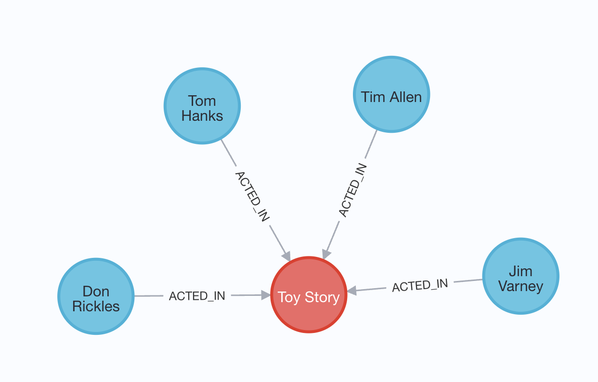
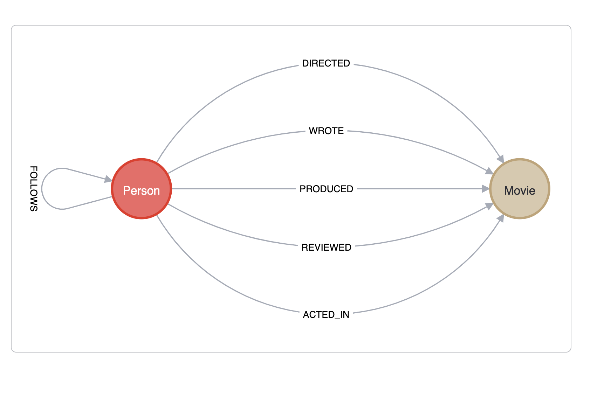

> Graph databases have their own query language, GQL, an ISO standard for graph databases.
> Cypher is Neo4j’s implementation of GQL. Cypher is a declarative language, meaning the database is responsible for
> finding the most optimal way of executing that query.

What gives Neo4j its advantage?
- Neo4j is a native graph database designed specifically for graph traversal.
- Where Joins between tables are computed at read-time, this information is saved in a way that allows for quick pointer-chasing in memory
- Queries in Graph Databases are proportional to the amount of data touched during a query, not the size of data overall.


- `MATCH` to read data
- `MERGE` to write data

```
MATCH (n:Person)
WHERE n.name = 'Tom Hanks'
RETURN n
```

Run the following Cypher statement to find the movie 'Toy Story' and the people who acted in the movie. The query uses the [ACTED_IN] relationship to find Person nodes who have a connection to the Movie node.

```
MATCH (m:Movie)<-[r:ACTED_IN]-(p:Person)  
WHERE m.title = 'Toy Story'  
RETURN m, r, p
```



```
MATCH (m:Movie)-[r:IN_GENRE]->(g:Genre)
WHERE m.title = 'Toy Story'
RETURN m, r, g
```

You can return tabular data by including the properties of the nodes.

```
MATCH (m:Movie)-[r:IN_GENRE]->(g:Genre)
WHERE m.title = 'Toy Story'
RETURN m.title, g.name
```


```
MATCH (m:Movie)<-[r:ACTED_IN]-(p:Person)
WHERE p.name = 'Emma Stone'
RETURN m.title, m.released
```

The statement returns all the movies that have been rated by the user "Mr. Jason Love".

```
MATCH (u:User)-[r:RATED]->(m:Movie)
WHERE u.name = "Mr. Jason Love"
RETURN u, r, m
```

```
MATCH (u:User)-[r:RATED]->(m:Movie)
WHERE u.name = "Mr. Jason Love"
RETURN u.name, r.rating, m.title
```


```
MATCH (p:Person)-[r:ACTED_IN]->(m:Movie)
WHERE p.name = 'Tom Hanks'
RETURN p.name AS person, m.title AS title, r.role AS role
```

or 

```
MATCH (p:Person {name: 'Tom Hanks'})-[:ACTED_IN]->(m:Movie)
RETURN m.title
```

> The MATCH clause is used to find patterns in the data.
> Patterns can be as simple as a single node, or contain multiple relationships.

```
MATCH (p:Person)-[:ACTED_IN]->(m:Movie)<-[r:ACTED_IN]-(p2:Person)
WHERE p.name = 'Tom Hanks'
RETURN p.name as main_actor, p2.name AS actor, m.title AS movie, r.role AS role
```

> The MERGE Clause
> To create nodes and relationships in the database, you use the MERGE clause.
> You can use the MERGE clause to create a pattern in the database. MERGE will only create the pattern if it doesn’t already exist.

Run this Cypher statement, that uses MERGE to create a new Movie node:

```
MERGE (m:Movie {title: "Arthur the King"})
SET m.year = 2024
RETURN m
```

Run this Cypher statement, that creates Movie and User nodes and a RATED relationship between them.

```
MERGE (m:Movie {title: "Arthur the King"})
MERGE (u:User {name: "Adam"})
MERGE (u)-[r:RATED {rating: 5}]->(m)
RETURN u, r, m
```

Run this query to return movies order by the most recent release date:

```
MATCH (m:Movie)
WHERE m.released IS NOT NULL
RETURN m.title AS title, m.url AS url, m.released AS released
ORDER BY released DESC LIMIT 5
```

Modify this query to add your favourite movie and a user rating

```
MERGE (m:Movie {title: "Java"})
MERGE (u:User {name: "Tuna"})
MERGE (u)-[r:RATED {rating: 1}]->(m)
RETURN u, r, m
```

```
MATCH (u:User)-[r:RATED]->(m:Movie)
WHERE m.title = 'Java'
RETURN m.title, u.name, r.rating
```

// example Cypher pattern  
```
(m:Movie {title: 'Cloud Atlas'})<-[:ACTED_IN]-(p:Person)
```

Two ways to filter MATCH queries:  

```
MATCH (p:Person {name: 'Tom Hanks'})
RETURN  p.born
```

```
MATCH (p:Person)
WHERE p.name = 'Tom Hanks' OR p.name = 'Rita Wilson'
RETURN p.name, p.born
```

> [!IMPORTANT]  
> In Cypher, labels, property keys, and variables are case-sensitive. Cypher keywords are not case-sensitive.
> Neo4j best practices include:
> Name labels using CamelCase. (Person)
> Name property keys and variables using camelCase. (title)
> Use UPPERCASE for Cypher keywords. (MATCH)

```
MATCH (p:Person {name: "Kevin Bacon"})
RETURN p.born
```

> Our data model dictates that the node at the other end of that relationship will be Movie node, so we don’t necessarily need to specify the :Movie label in the node - instead we will use the variable m.

```
MATCH (p:Person {name: 'Tom Hanks'})-[:ACTED_IN]->(m)
RETURN m.title
```

Who directed the movie Cloud Atlas?  

```
MATCH (m:Movie {title: "Cloud Atlas"})<-[:DIRECTED]-(p:Person)
RETURN p.name
```

```
MATCH (p:Person)-[:ACTED_IN]->(m:Movie)
WHERE 2000 <= m.released <= 2003
RETURN p.name, m.title, m.released
```

```
MATCH (p:Person)-[:ACTED_IN]->(m:Movie)
WHERE p.name='Jack Nicholson' AND m.tagline IS NOT NULL
RETURN m.title, m.tagline
```

```
MATCH (p:Person)-[:ACTED_IN]->()
WHERE p.name STARTS WITH 'Michael'
RETURN p.name
```

```
MATCH (p:Person)-[:ACTED_IN]->()
WHERE p.name ENDS WITH 'Michael'
RETURN p.name
```

```
MATCH (p:Person)-[:ACTED_IN]->()
WHERE p.name CONTAINS 'Michael'
RETURN p.name
```

> String tests are case-sensitive so you may need to use the toLower() or toUpper() functions to ensure the test yields the correct results. For example:

```
MATCH (p:Person)-[:ACTED_IN]->()
WHERE toLower(p.name) STARTS WITH 'michael'
RETURN p.name
```

> Suppose you wanted to find all people who wrote a movie but did not direct that same movie. Here is how you would perform the query:

```
MATCH (p:Person)-[:WROTE]->(m:Movie)
WHERE NOT exists( (p)-[:DIRECTED]->(m) )
RETURN p.name, m.title
```

```
MATCH (p:Person)
WHERE p.born IN [1965, 1970, 1975]
RETURN p.name, p.born
```

```
MATCH (p:Person)-[r:ACTED_IN]->(m:Movie)
WHERE  'Neo' IN r.roles AND m.title='The Matrix'
RETURN p.name, r.roles
```

> [!IMPORTANT]  
> The properties for a node with a given label need not be the same. One way you can discover the properties for a node is to use the keys() function. This function returns a list of all property keys for a node.

Discover the keys for the Person nodes in the graph by running this code:  

```
MATCH (p:Person)
RETURN p.name, keys(p)
```

More generally, you can run this code to return all the property keys defined in the graph.  

``` 
CALL db.propertyKeys()
```

Complete the WHERE clause in this query to filter for the movie title As Good as It Gets and for actors born after 1960. 

```
MATCH (p:Person)-[:ACTED_IN]->(m:Movie)
WHERE m.title='As Good as It Gets' AND p.born > 1960
RETURN p.name
```

### MERGE

* Use MERGE to create nodes in the graph.
* Use MERGE to create relationships in the graph.
* Create, update and remove properties for nodes and relationships in the graph.
* Perform conditional MERGE processing, depending on what is in the graph.
* Delete nodes and relationships from the graph.

`MERGE` creates a single node in the graph. Note that when you use `MERGE` to create a node, you must specify at least one property that will be the unique primary key for the node.  



> Using CREATE instead of MERGE to create nodes
> Cypher has a CREATE clause you can use for creating nodes. The benefit of using CREATE is that it does not look up the primary key before adding the node. You can use CREATE if you are sure your data is clean and you want greater speed during import.

```
MERGE (p:Person {name: 'Daniel Kaluuya'})
RETURN p
```

Multiple `MERGE`: 

```
MERGE (p:Person {name: 'Katie Holmes'})
MERGE (m:Movie {title: 'The Dark Knight'})
RETURN p, m
```

> Just like you can use MERGE to create nodes in the graph, you use MERGE to create relationships between two nodes. First you must have references to the two nodes you will be creating the relationship for.

```
MATCH (p:Person {name: 'Michael Caine'})
MATCH (m:Movie {title: 'The Dark Knight'})
MERGE (p)-[:ACTED_IN]->(m)
```

Verify that the relationship has been created.

```
MATCH (p:Person {name: 'Michael Caine'})-[:ACTED_IN]-(m:Movie {title: 'The Dark Knight'})
RETURN p, m
```

```
MERGE (p:Person {name: 'Chadwick Boseman'})
MERGE (m:Movie {title: 'Black Panther'})
MERGE (p)-[:ACTED_IN]-(m)
```

> [!IMPORTANT]   
> Note that in this MERGE clause where we create the relationships, we did not specify the direction of the relationship. By default, if you do not specify the direction when you create the relationship, it will always be assumed left-to-right.

Confirm with the following query: 

```
MATCH (p:Person {name: 'Chadwick Boseman'})-[:ACTED_IN]-(m:Movie {title: 'Black Panther'})
RETURN p, m
```

You have already seen how to create the primary key property for a node. You can also set a property for a relationship inline as follows:  

```
MATCH (p:Person {name: 'Michael Caine'})
MERGE (m:Movie {title: 'Batman Begins'})
MERGE (p)-[:ACTED_IN {roles: ['Alfred Penny']}]->(m)
RETURN p,m
```

We also have the option to use the SET keyword for setting a property value. In the context of particular MERGE or MATCH clause where you have defined a variable to reference the node or relationship, you can set property values.  

```
MATCH (p:Person)-[r:ACTED_IN]->(m:Movie)
WHERE p.name = 'Michael Caine' AND m.title = 'The Dark Knight'
SET r.roles = ['Alfred Penny'], m.released = 2008
RETURN p, r, m
```

You can also use SET to update existing property:  

```
MATCH (p:Person)-[r:ACTED_IN]->(m:Movie)
WHERE p.name = 'Michael Caine' AND m.title = 'The Dark Knight'
SET r.roles = ['Mr. Alfred Penny']
RETURN p, r, m
```

```
MATCH (m:Movie {title: 'Get Out'})
SET m.tagline = ['Gripping, scary, witty and timely!'], m.released = 2017
RETURN m.title, m.tagline, m.released
```

You can remove or delete a property from a node or relationship by using the `REMOVE` keyword, or setting the property to `null`. 

```
MATCH (p:Person)-[r:ACTED_IN]->(m:Movie)
WHERE p.name = 'Michael Caine' AND m.title = 'The Dark Knight'
REMOVE r.roles
RETURN p, r, m
```

```
MATCH (p:Person)
WHERE p.name = 'Gene Hackman'
SET p.born = null
RETURN p
```

> [!IMPORTANT]  
> You should never remove the property that is used as the primary key for a node.

You can also specify behavior at runtime that enables you to set properties when the node is created or when the node is found. We can use the ON CREATE SET or ON MATCH SET conditions, or the SET keywords to set any additional properties. 

```
// Find or create a person with this name
MERGE (p:Person {name: 'McKenna Grace'})
// Only set the `createdAt` property if the node is created during this query
ON CREATE SET p.createdAt = datetime()
// Only set the `updatedAt` property if the node was created previously
ON MATCH SET p.updatedAt = datetime()
// Set the `born` property regardless
SET p.born = 2006
RETURN p
```

```
// Find or create a person with this name
MERGE (p:Person {name: 'Michael Caine'})
// Find or create a movie with this title
MERGE (m:Movie {title: 'The Cider House Rules'})
// Find or create a relationship between the two nodes
MERGE (p)-[:ACTED_IN]->(m)
```

The following will fail if Person exists:

```
MERGE (p:Person {name: 'Michael Caine'})-[:ACTED_IN]->(m:Movie {title: 'The Cider House Rules'})
RETURN p, m
```

Our graph has a Person node for Lucille Ball. Suppose we want to add the year that Lucille Ball was born to this node. The Person node for Lucille Ball has only the name property set to Lucille Ball.
How can we update this code to include her birth year of 1911? 

```
MERGE (p:Person {name: 'Lucille Ball'})
ON MATCH
SET p.born = 1911
RETURN p
```

```
MERGE (m:Movie {title: 'Rocketman'})
ON CREATE SET m.createdAt = datetime()
ON MATCH SET m.updatedAt = datetime()
SET m.tagline = "The Only Way to Tell His Story is to live His Fantasy.",
m.released = 2019
RETURN m
```

```
MATCH (m:Movie {title: 'Rocketman'})
RETURN m.title, m.createdAt, m.updatedAt
```

In a Neo4j database you can delete:  
nodes, relationships, properties, labels  

### Deleting a node
```
MATCH (p:Person {name: 'Jane Doe'})
DELETE p
```

### Deleting a relationship
```
MATCH (p:Person {name: 'Jane Doe'})-[r:ACTED_IN]->(m:Movie {title: 'The Matrix'})
DELETE r
RETURN p, m
```

```
MATCH (p:Person {name: 'Jane Doe'})
DELETE p
```

If we attempt to delete the Jane Doe node, we will receive an error because it has relationships in the graph.  

This throws error since Neo4j prevents orphaned relationships in the graph.

### Deleting a relationship

```
MATCH (p:Person {name: 'Jane Doe'})
DETACH DELETE p
```

You can also delete all nodes and relationships in a database with this code.

```
MATCH (n)
DETACH DELETE n
```

> [!IMPORTANT]
> You should only do this on relatively small databases as trying to do this on a large database will exhaust memory.

### Deleting labels
A best practice is to have at least one label for a node. 

```
MERGE (p:Person {name: 'Jane Doe'})
SET p:Developer
RETURN p
```

The Jane Doe node has two labels, Person and Developer. You can use a MATCH to find that node. Note that you could have specified MATCH (p:Developer {name: 'Jane Doe'}) or MATCH (p:Person:Developer {name: 'Jane Doe'}) to find the same node. 

```
MATCH (p:Person {name: 'Jane Doe'})
REMOVE p:Developer
RETURN p
```

```
MATCH (p:Person:Developer {name: 'Jane Doe'})
RETURN p
```

``` 
MATCH (d:Developer {name: 'Jane Doe'})
DETACH DELETE d
``` 

You can find out what labels exist in the graph with this code: 
```
CALL db.labels()
```
