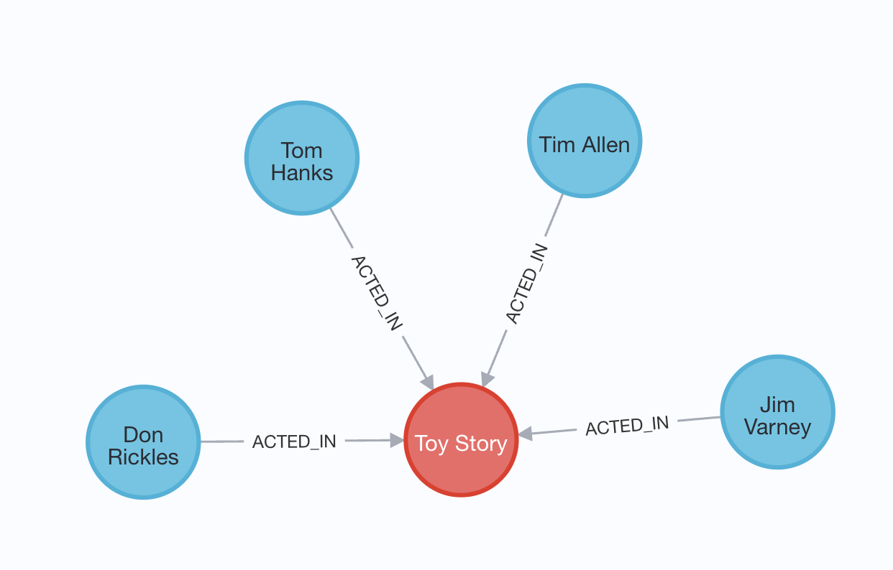
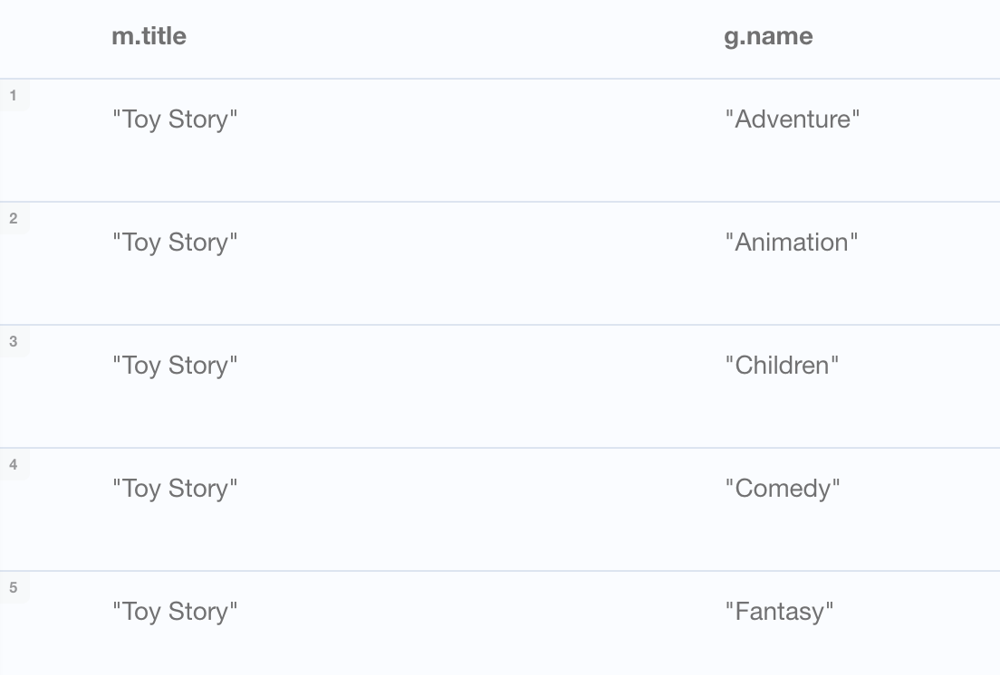
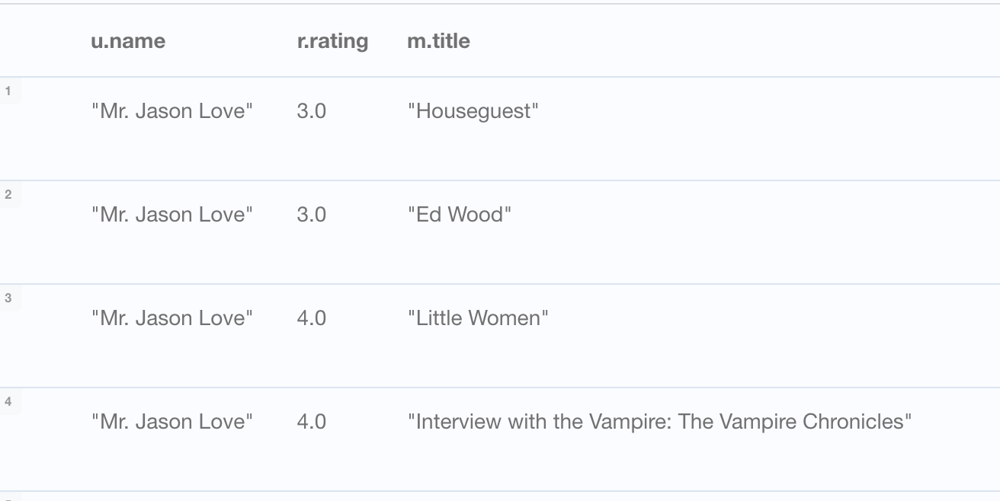

> Graph databases have their own query language, GQL, an ISO standard for graph databases.
> Cypher is Neo4j’s implementation of GQL. Cypher is a declarative language, meaning the database is responsible for
> finding the most optimal way of executing that query.

- `MATCH` to read data
- `MERGE` to write data

`
MATCH (n:Person)
WHERE n.name = 'Tom Hanks'
RETURN n
`

Run the following Cypher statement to find the movie 'Toy Story' and the people who acted in the movie. The query uses the [ACTED_IN] relationship to find Person nodes who have a connection to the Movie node.

`
MATCH (m:Movie)<-[r:ACTED_IN]-(p:Person)  
WHERE m.title = 'Toy Story'  
RETURN m, r, p
`

`MATCH (m:Movie)-[r:IN_GENRE]->(g:Genre)
WHERE m.title = 'Toy Story'
RETURN m, r, g`

You can return tabular data by including the properties of the nodes.

`MATCH (m:Movie)-[r:IN_GENRE]->(g:Genre)
WHERE m.title = 'Toy Story'
RETURN m.title, g.name`

`MATCH (m:Movie)<-[r:ACTED_IN]-(p:Person)
WHERE p.name = 'Emma Stone'
RETURN m.title, m.released`

The statement returns all the movies that have been rated by the user "Mr. Jason Love".

`MATCH (u:User)-[r:RATED]->(m:Movie)
WHERE u.name = "Mr. Jason Love"
RETURN u, r, m`

`MATCH (u:User)-[r:RATED]->(m:Movie)
WHERE u.name = "Mr. Jason Love"
RETURN u.name, r.rating, m.title`

