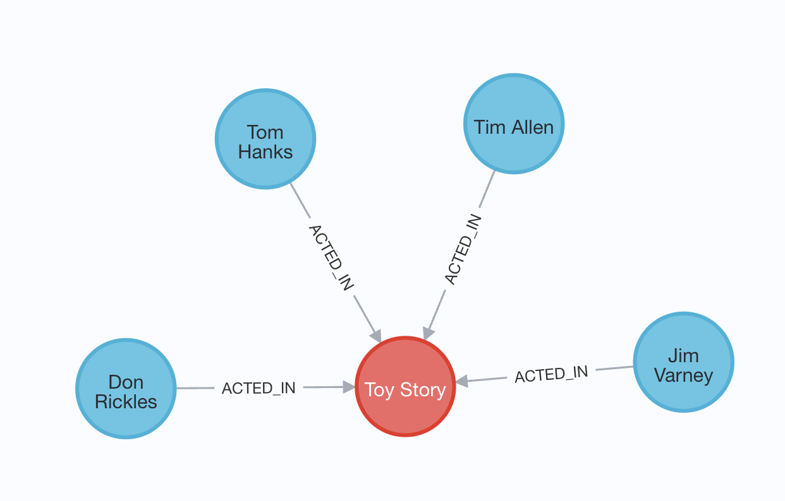
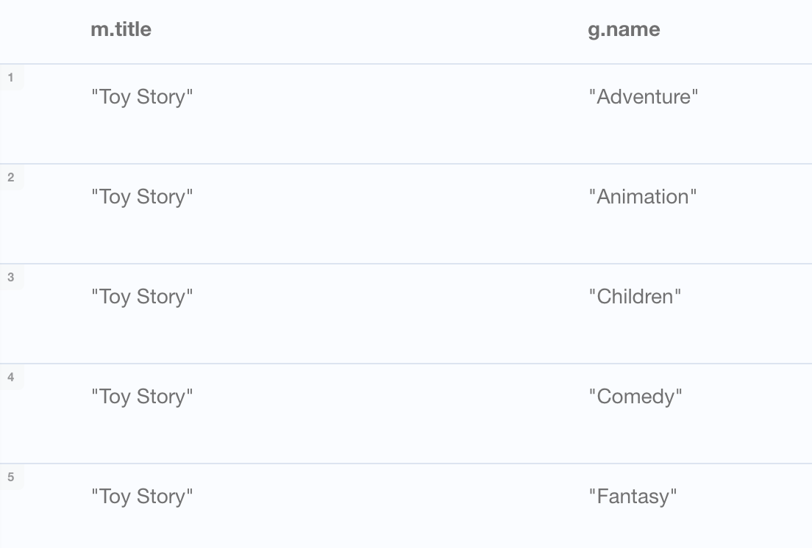
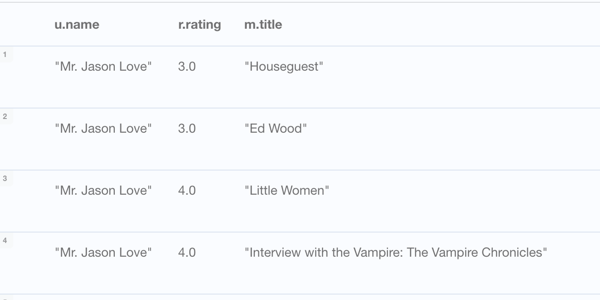

> Graph databases have their own query language, GQL, an ISO standard for graph databases.
> Cypher is Neo4j’s implementation of GQL. Cypher is a declarative language, meaning the database is responsible for
> finding the most optimal way of executing that query.

What gives Neo4j its advantage?
- Neo4j is a native graph database designed specifically for graph traversal.
- Where Joins between tables are computed at read-time, this information is saved in a way that allows for quick pointer-chasing in memory
- Queries in Graph Databases are proportional to the amount of data touched during a query, not the size of data overall.

- `MATCH` to read data
- `MERGE` to write data

`
MATCH (n:Person)
WHERE n.name = 'Tom Hanks'
RETURN n
`

Run the following Cypher statement to find the movie 'Toy Story' and the people who acted in the movie. The query uses the [ACTED_IN] relationship to find Person nodes who have a connection to the Movie node.

`
MATCH (m:Movie)<-[r:ACTED_IN]-(p:Person)  
WHERE m.title = 'Toy Story'  
RETURN m, r, p
`

`MATCH (m:Movie)-[r:IN_GENRE]->(g:Genre)
WHERE m.title = 'Toy Story'
RETURN m, r, g`

You can return tabular data by including the properties of the nodes.

`MATCH (m:Movie)-[r:IN_GENRE]->(g:Genre)
WHERE m.title = 'Toy Story'
RETURN m.title, g.name`

`MATCH (m:Movie)<-[r:ACTED_IN]-(p:Person)
WHERE p.name = 'Emma Stone'
RETURN m.title, m.released`

The statement returns all the movies that have been rated by the user "Mr. Jason Love".

`MATCH (u:User)-[r:RATED]->(m:Movie)
WHERE u.name = "Mr. Jason Love"
RETURN u, r, m`

`MATCH (u:User)-[r:RATED]->(m:Movie)
WHERE u.name = "Mr. Jason Love"
RETURN u.name, r.rating, m.title`

`MATCH (p:Person)-[r:ACTED_IN]->(m:Movie)
WHERE p.name = 'Tom Hanks'
RETURN p.name AS person, m.title AS title, r.role AS role
`
or 

`MATCH (p:Person {name: 'Tom Hanks'})-[:ACTED_IN]->(m:Movie)
RETURN m.title`

> The MATCH clause is used to find patterns in the data.
> Patterns can be as simple as a single node, or contain multiple relationships.

`MATCH (p:Person)-[:ACTED_IN]->(m:Movie)<-[r:ACTED_IN]-(p2:Person)
WHERE p.name = 'Tom Hanks'
RETURN p.name as main_actor, p2.name AS actor, m.title AS movie, r.role AS role`

> The MERGE Clause
> To create nodes and relationships in the database, you use the MERGE clause.
> You can use the MERGE clause to create a pattern in the database. MERGE will only create the pattern if it doesn’t already exist.

Run this Cypher statement, that uses MERGE to create a new Movie node:

`MERGE (m:Movie {title: "Arthur the King"})
SET m.year = 2024
RETURN m`

Run this Cypher statement, that creates Movie and User nodes and a RATED relationship between them.

`MERGE (m:Movie {title: "Arthur the King"})
MERGE (u:User {name: "Adam"})
MERGE (u)-[r:RATED {rating: 5}]->(m)
RETURN u, r, m`

Run this query to return movies order by the most recent release date:

`MATCH (m:Movie)
WHERE m.released IS NOT NULL
RETURN m.title AS title, m.url AS url, m.released AS released
ORDER BY released DESC LIMIT 5`

Modify this query to add your favourite movie and a user rating

`MERGE (m:Movie {title: "Java"})
MERGE (u:User {name: "Tuna"})
MERGE (u)-[r:RATED {rating: 1}]->(m)
RETURN u, r, m`

`MATCH (u:User)-[r:RATED]->(m:Movie)
WHERE m.title = 'Java'
RETURN m.title, u.name, r.rating`

// example Cypher pattern  
`(m:Movie {title: 'Cloud Atlas'})<-[:ACTED_IN]-(p:Person)`

Two ways to filter MATCH queries:  

`MATCH (p:Person {name: 'Tom Hanks'})
RETURN  p.born
`
`MATCH (p:Person)
WHERE p.name = 'Tom Hanks' OR p.name = 'Rita Wilson'
RETURN p.name, p.born`

> [!IMPORTANT]  
> In Cypher, labels, property keys, and variables are case-sensitive. Cypher keywords are not case-sensitive.
> Neo4j best practices include:
> Name labels using CamelCase. (Person)
> Name property keys and variables using camelCase. (title)
> Use UPPERCASE for Cypher keywords. (MATCH)

`MATCH (p:Person {name: "Kevin Bacon"})
RETURN p.born`

> Our data model dictates that the node at the other end of that relationship will be Movie node, so we don’t necessarily need to specify the :Movie label in the node - instead we will use the variable m.

`MATCH (p:Person {name: 'Tom Hanks'})-[:ACTED_IN]->(m)
RETURN m.title`

Who directed the movie Cloud Atlas?  

`MATCH (m:Movie {title: "Cloud Atlas"})<-[:DIRECTED]-(p:Person)
RETURN p.name`

`MATCH (p:Person)-[:ACTED_IN]->(m:Movie)
WHERE 2000 <= m.released <= 2003
RETURN p.name, m.title, m.released`

`MATCH (p:Person)-[:ACTED_IN]->(m:Movie)
WHERE p.name='Jack Nicholson' AND m.tagline IS NOT NULL
RETURN m.title, m.tagline
`

`MATCH (p:Person)-[:ACTED_IN]->()
WHERE p.name STARTS WITH 'Michael'
RETURN p.name`

`MATCH (p:Person)-[:ACTED_IN]->()
WHERE p.name ENDS WITH 'Michael'
RETURN p.name`

`MATCH (p:Person)-[:ACTED_IN]->()
WHERE p.name CONTAINS 'Michael'
RETURN p.name`

> String tests are case-sensitive so you may need to use the toLower() or toUpper() functions to ensure the test yields the correct results. For example:

`MATCH (p:Person)-[:ACTED_IN]->()
WHERE toLower(p.name) STARTS WITH 'michael'
RETURN p.name
`

> Suppose you wanted to find all people who wrote a movie but did not direct that same movie. Here is how you would perform the query:

`MATCH (p:Person)-[:WROTE]->(m:Movie)
WHERE NOT exists( (p)-[:DIRECTED]->(m) )
RETURN p.name, m.title`

`MATCH (p:Person)
WHERE p.born IN [1965, 1970, 1975]
RETURN p.name, p.born
`

`MATCH (p:Person)-[r:ACTED_IN]->(m:Movie)
WHERE  'Neo' IN r.roles AND m.title='The Matrix'
RETURN p.name, r.roles`

> [!IMPORTANT]  
> The properties for a node with a given label need not be the same. One way you can discover the properties for a node is to use the keys() function. This function returns a list of all property keys for a node.

Discover the keys for the Person nodes in the graph by running this code:  

`MATCH (p:Person)
RETURN p.name, keys(p)`

More generally, you can run this code to return all the property keys defined in the graph.  

`CALL db.propertyKeys()`

Complete the WHERE clause in this query to filter for the movie title As Good as It Gets and for actors born after 1960. 

`MATCH (p:Person)-[:ACTED_IN]->(m:Movie)
WHERE m.title='As Good as It Gets' AND p.born > 1960
RETURN p.name`